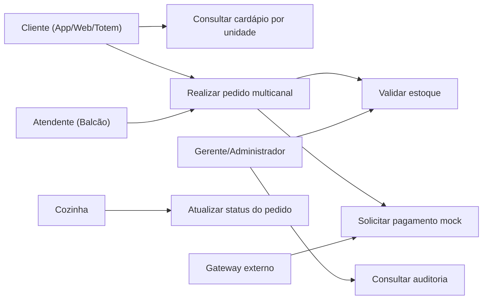
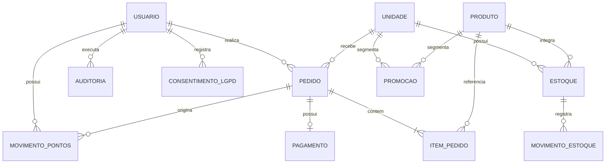
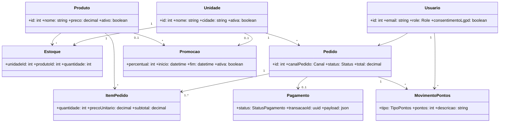
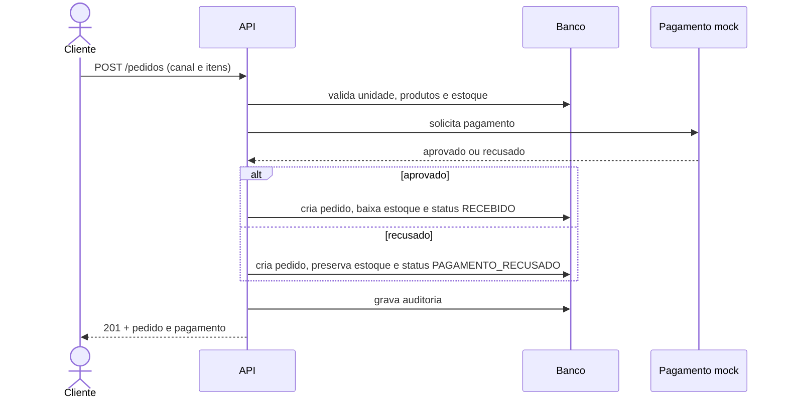

# Diagramas da solução

## Casos de uso

## DER

## Classes de domínio

## Sequência do fluxo crítico

## Caso de uso crítico: realizar pedido

- Atores: Cliente/Atendente e gateway de pagamento.
- Pré-condições: usuário autenticado; unidade ativa; produtos cadastrados.
- Fluxo principal: informar unidade, canal e itens; validar disponibilidade; calcular preços no servidor; criar pedido; aprovar pagamento mock; baixar estoque; marcar como `RECEBIDO`; auditar.
- Pós-condição: pedido persistido e rastreável pelo canal.
- Exceções: canal inválido (400), produto/unidade inexistente (404), estoque insuficiente (409), pagamento recusado (pedido persistido sem baixa de estoque).
- Regra futura: aceitar `Idempotency-Key` para impedir pedidos duplicados em retries.

## Cancelamento e compensação

O cancelamento é uma operação transacional disponível enquanto o pedido está em `RECEBIDO`. A API muda o status para `CANCELADO`, devolve cada item ao estoque, registra movimentos, remove os pontos gerados, devolve pontos resgatados e cria auditoria. A atualização genérica de status não aceita `CANCELADO`, evitando cancelamentos sem compensação.

## Fidelização e promoções

O cliente que consentiu recebe um ponto por real efetivamente pago. Dez pontos equivalem a R$ 1,00. Campanhas podem ser gerais ou segmentadas por unidade/produto e possuem período de vigência. Quando mais de uma campanha se aplica ao mesmo item, prevalece o maior percentual para impedir descontos cumulativos não planejados.
